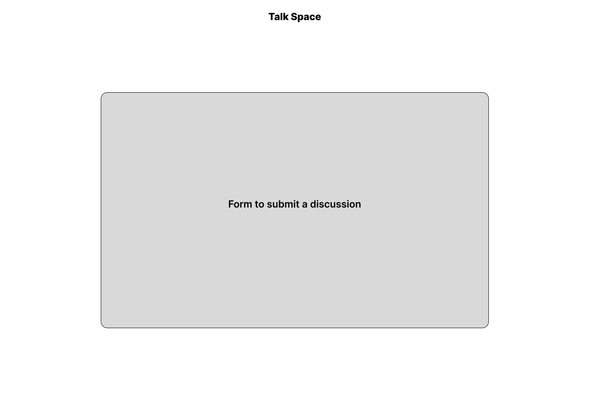

## TalkSpace 

Welcome to TalkSpaceFE , a discussion app where users can post and engage in meaningful discussions. 

## Table of Contents
- [Technologies Used](#technologies-used)
- [Getting Started](#getting-started)
- [Deployed Site](#deployed-site)


## Technologies used:
- React
- javaScript
- bootstrap

## Mockup



## Getting Started

To get started with the backend set up , follow these steps:

1. Clone this repository.
2. Navigate to the `talkspace` directory.
3. Install dependencies using your preferred package manager:

   ```bash
   npm install
   # or
   yarn install

## Deployed Site
[Talkspace](https://talk-space-fe.vercel.app/createadiscussion)